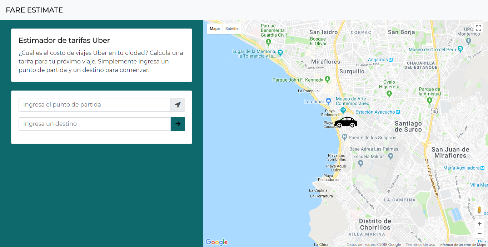
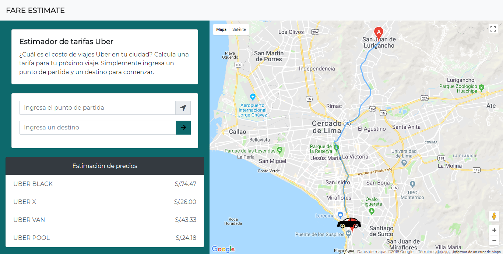

# FARE ESTIMATE

* **Track:** _FRONT-END-DEVELOPER_
* **Curso:** _Construye una Single Page App (spa) multi-usuario consumiendo data remota_
* **Unidad:** _5_

***

## Introducción 

FARE ESTIMATE es una aplicación que permite al usuario establecer una ruta y estimar 4 tarifas diferentes dependiendo del tipo de servicio de taxi (Uber Black, Uber X, Uber Van y Uber Pool).

## Plan de trabajo

El proyecto se desarrolló en dos días y se crearon los siguientes issues y milestones que sirven como hoja de ruta (roadmap):

* Inicializar el proyecto con hosting de firebase. 
* Inicializar el proyecto con babel, jquery, bootstrap. 
* Primer maquetado.
* Crear marcador de auto.
* Funcionalidad de autocompletado y trazar ruta.
* Funcionalidad para estimador de tarifas.
* Elaborar readme.

## Archivos importantes

El proyecto presenta los siguientes archivos para uso del usuario:

* `README.md` con descripción de la aplicación, uso y ejemplo.
* `index.js`: Archivo js que contiene la funcionalidad de la aplicación.
* `index.html`: Página web de la aplicación.

## Especificaciones

* Se utilizó el API de Google Maps.
* Se utilizó servicio de hosting de Firebase.
* Se utilizó la librería jQuery en su versión 3.2.1 (como parte del framework bootstrap y como parte del desarrollo).
* Se utilizó el framework bootstrap en su versión 4.0.
* Se utilizó el estándar más recientemente aceptado de JavaScript ES2015 || ES6.
* Se utilizó el transpilador/compilador Babel para que convierta nuestro código en ES5 de forma automática.
* Mobile first.

***

## Uso
* El usuario tiene que ingresar un punto de partida y un punto de destino, y al dar click en el botón "flecha", se muestra debajo el tarifario y en el mapa de la derecha se observa el trazado de la ruta.
* En la versión mobile, el mapa se ubica debajo del tarifario.

## Ejemplo

* Vista principal del proyecto:

* Vista ruta y tarifario:

***

## Autoras

* Rocci Escobar Nuñez [Cuenta GitHub](https://github.com/Rocciescobar "Repositorio")
* Manuela Flores Vilchez [Cuenta GitHub ](https://github.com/ManuelaFlores "Repositorio")
